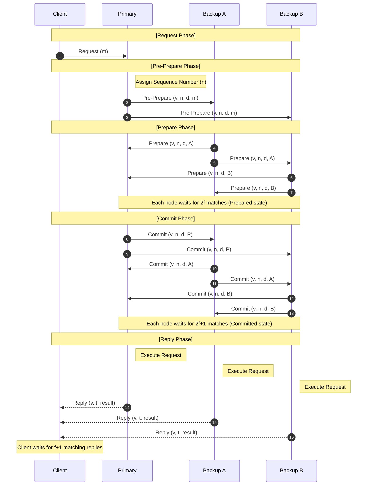

> AI를 통해 번역 및 요약한 글입니다.  
> 논문의 서술 순서를 최대한 유지하되, 쉬운 이해를 위해, 일부 순서가 바뀌거나 생략된 경우가 있습니다.  
> paper : [LINK](https://css.csail.mit.edu/6.824/2014/papers/castro-practicalbft.pdf)
{: .prompt-warning }

> 직접 작성한 추가 설명은 파란색으로 별도 표기했습니다.
{: .prompt-info }

> 이해를 돕기 위해 직접 작성한 SequenceDiagram을 포함하고 있습니다.
{: .prompt-info }

## 1. Introduction

악의적인 공격과 소프트웨어 오류가 점점 흔해지고 있으며, 이는 노드가 임의의 행동(비잔틴 결함)을 하게 만듭니다. 기존의 비잔틴 결함 허용 알고리즘들은 이론적인 증명에 그쳐 너무 느리거나, 동기식 시스템*(메시지 지연 시간이 일정 범위 내에 있다고 가정)에서만 작동하여 실제 인터넷 환경에서는 사용하기 어려웠습니다.

> sync/async*  
> 개발 관점에서의 동기 : 코드 실행이 멈춤  
> 개발 관점에서의 비동기 : 응답을 콜백으로 받고 다음 코드를 즉시 실행함  
> 본 논문에서의 동기 : 메시지 전달이 정해진 시간(delta) 안에 도착이 보장됨  
> 본 논문에서의 비동기 : 메시지 전달에 걸린 시간을 알 수 없음  
{: .prompt-info }

## 2. System Model
- **비동기 분산 시스템**: 노드들이 네트워크로 연결되어 있으며, 메시지는 지연, 중복, 유실되거나 순서가 뒤바뀌어 전달될 수 있다고 가정함.
- **비잔틴 결함 모델**: 결함이 있는 노드는 임의의 방식으로 행동할 수 있음. 결함의 독립성을 보장하기 위해 각 노드는 서로 다른 소프트웨어 구현체, 운영체제, 관리자를 가짐.
- **강력한 공격자**: 결함 노드를 조종하고 통신을 지연시킬 수 있는 강력한 적을 가정하지만, 암호화 기술을 무력화하거나 정상 노드를 무한정 지연시킬 수는 있는 공격자는 가정하지 않음.

## 3. Service Properties
- **결정론적(deterministic*) 서비스**: 상태와 연산을 가진 모든 결정론적 복제 서비스를 구현하는 데 사용될 수 있으며, 클라이언트는 요청 후 응답을 기다림.
- **안전성(Safety)**: 최대 $\lfloor \frac{n-1}{3} \rfloor$개의 결함 노드가 있을 때, 시스템이 중앙 집중식 구현처럼 원자적으로 연산을 수행함(선형성 보장)을 의미함. 결함이 있는 클라이언트가 있더라도 일관성을 유지함.
- **활성성(Liveness)**: 클라이언트가 결국 요청에 대한 응답을 받음을 보장함. 안전성과 달리 활성성을 위해서는 메시지 지연 시간이 무한히 늘어나지 않는다는 약한 동기성 가정*이 필요함.
- **복원력의 최적성**: $f$개의 결함 노드가 있을 때 안전성과 활성성을 보장하기 위한 최소 복제본 수는 **$3f+1$**개임
- **프라이버시 한계**: 이 알고리즘은 결함 노드가 정보를 유출하는 프라이버시 문제는 다루지 않음

> deterministic*  
> 논문에 정의된 정확한 표현인데 '동일 입력 -> 동일 결과'의 의미를 state의 관점에서 정확하게 기술한 표현이라 생각된다. the execution of an operation in a given state and with a given set of arguments must always produce the same result.
{: .prompt-info }

> 약한 동기성 가정*  
> safety는 sync에 의존하지 않는다. liveness는 어쩔 수 없이 async에 의존해야 한다.  
> 악의적인 노드는 정상 노드의 네트워크에 악영향을 미칠 수 있는 공격자로 가정했다. 노드가 네트워크의 지연에 의해서 응답을 하지 않는 것인지, 노드가 다운된 것인지 확인할 수 없다. 또한 이러한 현상이 정상 노드에서 발생한 것인지 악의적인 노드에 의해서 발생한 것인지 구분할 수 없다.  
> safety를 위해서라면 응답이 없는 노드가 다시 응답할 때까지 무한정 기다려야하지만 이는 다시 liveness를 해치게 된다. 따라서 메시지 지연 시간이 무한정 늘어나지는 않는다는 약한 동기성 가정이 필요하다.
{: .prompt-info }

> f와 정족수(Quorum)
> - f : 비잔틴 노드 수
>   - 시스템 내에서 동시에 발생할 수 있는 최대 결함(고장 또는 배신) 노드 수
> - 3f + 1 : 전체 노드 수
>   - $f$개의 노드가 배신하더라도 시스템이 정상 작동하기 위한 최소 노드 구성
> - 전체 노드 수가 2f +1로 충분하지 않은 이유
>   - $f$개가 응답하지 않는 경우, 남은 $n-f$개만으로 합의를 진행할 수 있어야 함
>   - 이 $n-f$개 안에는 반드시 배신자($f$개)보다 정상 노드($f+1$개)가 많아야 한다.
>   - 진행을 위해 필요한 최소 응답 수: $n - f$ 
>   - (가용성 보장)응답자 중 최악의 경우 배신자 수: $f$ 
>   - (가장 나쁜 상황 가정)응답자 중 확실한 정상 노드 수: $(n - f) - f$ = $n-2f$
>   - 성립해야 하는 조건: (응답한 정상 노드 수) > (응답한 비잔틴 노드 수) = $n-2f>f$
> - f + 1 : 어떤 집단 안에 $f+1$개의 노드가 있다면, 그 안에는 적어도 한 개의 정상적인 노드가 포함되어 있음이 보장됩니다. (배신자가 최대 $f$개이므로)
> - 2f + 1 : 전체 노드($3f+1$) 중 절대다수의 합의를 의미한다
>   - 핵심 원리: $2f+1$개로 구성된 두 집단이 있다면, 그 두 집단의 교집합에는 반드시 적어도 한 개의 정상적인 노드가 포함됩니다. 이 원리 덕분에 뷰가 바뀌어도 이전의 합의 내용이 사라지지 않고 전달될 수 있습니다.
{: .prompt-info }

## 4. Algorithm

PBFT는 일부 노드가 배신하거나 고장나더라도(Byzantine Fault), 시스템 전체가 합의된 순서대로 요청을 처리하도록 보장합니다. 총 노드 $3f+1$개 중 $f$개의 결함이 있어도 안전합니다.

### 4.0. Committed vs Committed-local

- Committed (논리적/시스템 관점)
  - 정의: 특정 $f+1$개 이상의 정상적인 레플리카들이 모두 해당 요청에 대해 prepared 상태가 되었을 때 성립하는 논리적 술어($predicate$)입니다.
  - 의미: 시스템 전체적으로 합의가 결코 뒤집힐 수 없는 상태가 되었음을 의미합니다.
- Committed-local (개별 노드 관점)
  - 정의: 특정 레플리카 $i$가 다음 두 조건을 만족하여, 스스로 committed가 성립했음을 알게 된 상태입니다.
    - 레플리카 $i$가 prepared 상태임.
    - 다른 레플리카들로부터 $2f+1$개의 일치하는 커밋 메시지를 수신함.
  - 의미: 개별 노드가 "이 요청은 이제 안전하게 실행해도 된다"라고 판단하는 근거가 됩니다. ($2f+1$개를 확인하면 그중 최소 $f+1$개는 정상 노드의 응답이므로, 시스템 전체가 committed 상태에 도달했음을 확신할 수 있음)

### 4.1. 주요 역할

* **클라이언트(Client):** 서비스를 요청하는 사용자.

* **프라이머리(Primary/Leader):** 요청의 순서($n$)를 제안하고 프로토콜을 주도.

* **백업(Backup):** 리더의 제안을 검증하고 합의에 참여.

### 4.2. 3단계 프로토콜 (The Three Phases)

리더가 요청을 받으면 다음의 엄격한 단계를 거칩니다.

#### ① 사전 준비 단계 (Pre-prepare)

* **동작:** 리더가 요청 $m$에 순서 번호 $n$을 할당하여 모든 노드에게 전달합니다.

* **조건:** "이번 요청은 $v$번 뷰에서 $n$번 순서로 처리한다!"

* **핵심:** 리더가 같은 번호에 다른 요청을 할당하는 '이중 제안'을 방지하기 위한 시작점입니다.

#### ② 준비 단계 (Prepare)

* **동작:** 리더의 제안을 받은 노드들은 검증 후 서로에게 준비 메시지를 보냅니다.

* **준비 완료(**$prepared$**):** 다음 세 가지가 로그에 모이면 해당 노드는 `prepared` 상태가 됩니다.
  1. 클라이언트의 요청 $m$
  2. 리더의 `prepared` 메시지
  3. 다른 노드들로부터 받은 $2f$**개의 일치하는 준비 메시지** (본인 포함 총 $2f+1$개)
* **의미:** "최소 $2f+1$개의 정상적인 노드가 이 요청을 이 순서로 처리하기로 약속했다"는 것을 보장합니다.

#### ③ 커밋 단계 (Commit)

* **동작:** `prepared` 상태가 된 노드는 "준비됐으니 이제 확정하자!"라며 커밋 메시지를 브로드캐스트합니다.
* **커밋 완료(**$committed-local$**):** 다음 조건이 충족되면 노드는 `committed-local` 상태가 됩니다.
  1. 해당 요청이 `prepared` 상태여야 함.
  2. 다른 노드들로부터 $2f+1$**개의 일치하는 커밋 메시지**를 수신함.
* **의미:** "이 요청은 나중에 리더가 바뀌더라도(뷰 변경) 절대 뒤집히지 않는다"는 영구적 확정입니다.

### 4.3. 실행 및 응답 (Execution & Reply)

합의가 끝났다고 바로 실행하는 것이 아니라, **순서**를 지키는 것이 매우 중요합니다.

* **실행 조건:** 1. 해당 요청이 `committed-local` 상태여야 함.
  2. 해당 요청의 번호($n$)보다 **작은 번호의 모든 요청이 이미 실행**되었어야 함.

* **응답:** 실행이 완료되면 각 노드는 결과를 직접 클라이언트에게 보냅니다. 클라이언트는 서로 다른 노드들로부터 $f+1$**개의 동일한 결과**를 받으면 해당 요청이 최종 완료된 것으로 간주합니다.

### 4.4. 핵심 불변성 (Safety Invariant)

1. **Prepare 단계의 목적:** "동일한 뷰(View)" 내에서 요청들의 순서를 고정합니다. (리더의 배신 방지)

2. **Commit 단계의 목적:** "뷰가 바뀌어도(View Change)" 이미 합의된 순서가 유지됨을 보장합니다.

즉, 어떤 노드가 $n$번 요청을 실행했다면, 다른 어떤 정상적인 노드도 $n$번에 다른 요청을 실행할 수 없게 됩니다.

## 5. Sequence Diagram

- v (View): 현재 시스템의 뷰 번호입니다. 리더(Primary)가 바뀔 때마다 증가하며, 현재 어떤 노드가 리더인지 식별하는 기준이 됩니다.
- n (Sequence Number): 요청에 할당된 순서 번호입니다. 리더가 요청을 수신한 순서대로 부여하여 전체 순서(Total Order)를 보장합니다.
- m (Message): 클라이언트가 서비스 수행을 위해 보낸 실제 요청 내용입니다.
- d (Digest): 요청 메시지 $m$의 해시값($D(m)$)입니다. 메시지가 변조되지 않았음을 빠르게 검증하기 위해 사용됩니다.
- t (Timestamp): 클라이언트가 요청에 부여한 시간 정보입니다. 동일한 요청이 중복 처리되는 것을 방지하고 결과의 최신성을 보장합니다.
- i (Replica ID): 메시지를 보낸 각 노드(Primary 또는 Backup)의 고유 식별자입니다. (다이어그램에서는 P, A, B 등으로 표시)
